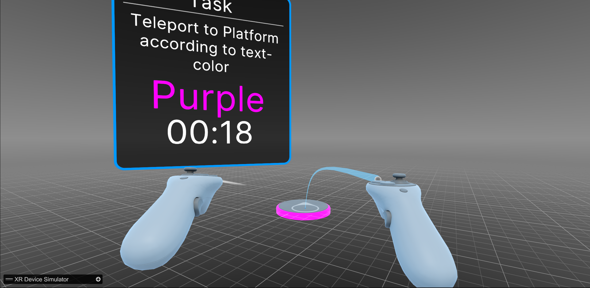

# DM2905 - StressPort: A VR Study Design for Teleportation Under Game-Like Stressful Conditions


## About the study
### Objective
The experiment is designed to investigate how exposure to game-like stressors affects teleportation performance, perceived stress, and workload in VR environments.

### Motivation
Gathering reliable results from user evaluations is crucial for informing design decisions. While prior studies have explored stress responses during gameplay in fully developed or modified games, the intermediate step between isolated lab-based evaluations and in-game scenarios remains underexplored. This research seeks to bridge that gap by designing a test environment that enables the researcher to examine the impact of stressors in a controlled VR teleportation evaluation task, simulating high-arousal states typical of fast-paced video games.

### Experience Overview
In this experimental design, the subjects have to teleport between 6 hexagon- layout platforms. Each platform represented a different color (red, blue, green, yellow, cyan, and purple). Subjects are given one teleportation instruction at a time in the form of color displayed on a VR GUI to move to a destination.
Once at the destination platform, they activate a mechanism to cue the system for the next platform.

This instance of the prototype includes two teleportation methods and baseline + three game stressors, but further methods and stressors can be added according to the research’s needs. Sound feedback, dynamic Stroop rules, and adjustments to attention-demanding stimuli are critical next steps for enhancing the prototype’s functionality. The design hopes to help advance the understanding of VR teleportation evaluation under game-like stressors and serve as a starting point for future researchers and VR game developers.

## Dependencies
- Platfrom: Meta Quest 3S VR headset using the OpenXR Plugin and Unity's Interaction Toolkit SDK 
- Unity version 6000.0.62f1 using the Built-in Render Pipeline
- OpenXR SDK and the virtual simulator (powered using Vulkan)
*When the application is installed onto the HMD, the viewport can be streamed to a Device via the Meta Quest Developer Hub for real-time monitoring.

## Directories
The important files can be found in the following locations, any other files are dependencies from pluggings and they must not be removed or edited unless you know what you are doing. The **main scene** is `MainScene` inside the `/Scenes`.
```bash
Project/
├── Assets/
│   ├───Prefabs
│   │   └───Color Indicator Materials
│   ├───Scenes
│   │   └───SampleScene
│   ├───Scripts
│   ├───Settings
│   │   ├───Build Profiles
│   │   └───Project Configuration
│   ├───StreamingAssets
│   ├───XR
│   │   ├───AndroidXR
│   │   ├───Loaders
│   │   ├───Resources
│   │   ├───Settings
│   │   ├───Temp
│   │   └───UserSimulationSettings
│   │       └───Resources
│   └───XRI
│       └───Settings
│           └───Resources

```
**About Scripts:**
`Condition Manager`: Manages Condition Switching.
`Game Manager`: Handles specific experimental conditions and variables. Oversees overarching game logic or systems.
`Logger`: Logs data during the experiment, such as participant actions, timestamps, and experimental conditions. This data can be used for analysis after the experiment is completed.

## Overall architecture

`GameManager`
1. `My Timer (Game Timer)`: Drives per-round timing and countdown behavior.
2. `Setting Window (Setting Panel)`: Settings UI container.
3. `Task Window (Task Panel)`: Task UI container.
4. `Experiment Window (Study Panel)`: Study flow UI container.
5. `Color Display (Text Mesh Pro UGUI)`: Displays the target color prompt.
6. `Round Timer Text (Text Mesh Pro UGUI)`: Displays remaining round time.
7. `Task Description Text (Text Mesh Pro UGUI)`: Displays current task instructions.
8. `Center Platform (Teleport Main Area Setup)`: Reference to the center/starting platform.
9. `Input Field Manager (ID INPUT)`: Participant ID input handling.
10. `My Condition Manager (Condition Manager)`: Condition switching and state coordination.
11. `Study_Logger (Logger)`: Study/session logging.
12. `Teleportation Mode Controller (Teleport Interactor)`: Teleport mode configuration.
13. `Teleport Logger (Logger)`: Teleportation event logging.
14. `XR Ray Interactor (Teleport Interactor)`: XR ray reference for teleport targeting.
15. `Study Manager (Study Panel)`: Study UI controller.
16. `Is Game Running`: Runtime flag for active session.
17. `Is Practice Run`: Runtime flag for practice vs trial.
18. `Score Correct / Wrong / Skipped`: Per-round scoring counters.
19. `Current Target Color`: Current target state.
20. `Time Per Round`: Configured time per round.
21. `End Condition (Rounds Completed)`: Condition to end the task.
22. `Platform Max`: Max platforms in the sequence.
23. `Time Max`: Max session time.

**Key methods**
1. `SetupExperiment()`: Builds the Latin-square condition list and configures the study UI.
2. `StartTheWholeGame(bool practice)`: Starts a practice or trial run and initializes timers.
3. `EndGame()`: Stops the session, logs results, and restores menus.
4. `PickNewColor(string colorToAvoid)`: Chooses the next color prompt with optional avoidance.
5. `CheckIfCorrect(string platformName)`: Scores a landing and logs teleport data.
6. `OnPlatformTeleport(string platformName)`: Entry point when a platform is reached.

`ConditionManager`
1. `StressMode`: None, TimeLimit, ColorMismatch, Shrinking.
2. `ScenarioType`: Directional or Normal teleportation.
3. `GenerateLatinSquareConditionList(int participantID)`: Creates the 2-block, 4-condition Latin square.
4. `SelectStressMode(int stressID)`: Switches the active stressor by ID.
5. `SetTailCondition(TrialCondition trialCondition)`: Applies stressor and teleportation scenario.
6. `SetOrietationalTeleportation(bool setTrue)`: Toggles orientation-based teleportation.
7. `GetCurrentStressModeID()`: Returns the current stressor ID.
8. Wrapper buttons: `NoStress()`, `Time()`, `Mismatch()`, `Shrinking()`.


## Features
- **Start:** Set the participant ID and press the *Start* button to begin the experiment. This will trigger the `StartExperiment()` method in the `GameManager` class, which will set up the initial conditions for the experiment and start the game loop.
The participant ID is stored in the `ParticipantData` Scriptable Object, which can be accessed throughout the experiment to log data and track progress.
Also with the participant ID set, the experiment can proceed.

- **Latin-square sequencing:** `SetupExperiment()` builds a balanced 2-block sequence based on participant ID.
- **Color generation:** The color prompt is generated by `PickNewColor()`, which can avoid repeating the current platform color.
- **Participant and variables Data:** The information about what stimuli are active in a task is in `ParticipantData` Scriptable Object. The GUI writes directly to its field to toggle variables.

- **Time limit stressor:** Round timer counts down and auto-advances on timeout, incrementing skipped.
- **Color mismatch stressor:** Prompt text can intentionally differ from the actual target color.
- **Shrinking stressor:** Teleportation blocker shrinks the nav mesh area around platforms.
- **End conditions:** Session end can be time-based, round-based, or both.
- **Logging:** Study and teleport logs are written on trial completion; practice runs skip logging. The Logs can be found under `Android/data/<AppName>/files`


## Known issues
- The color prompter sometimes gives a color that corresponds to the current platform the player is standing.
- Teleportation on the right platform sometimes fails to register
